# Building a Better API Client in Swift

## Twilio Signal, May 2016

### Boris Bügling - @NeoNacho


<!--- use Next theme, white -->

---

## CocoaPods


---


^ Like a CMS... without the bad bits.
Meet Contentful, a headless CMS with an API at its core.

---

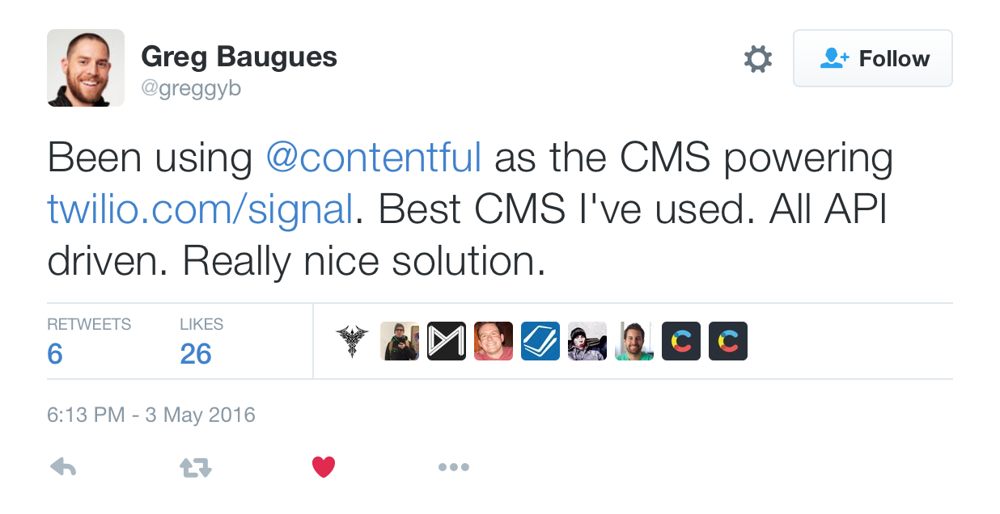

---

# Why do we want to build better API clients?

---


---

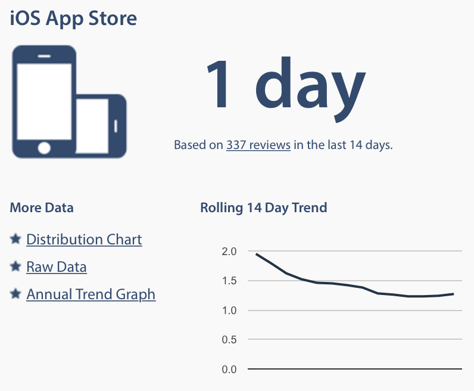

---

> Mobile apps need to be more reliable than the web.

---


---

> Let's build better API clients to help building better apps

---

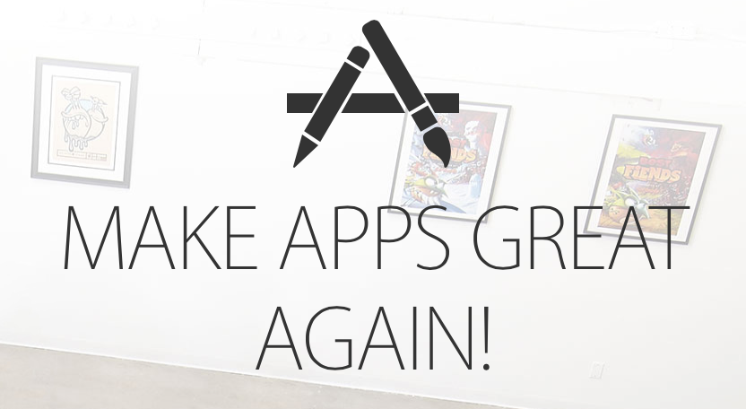

---

# What does better *mean*?

---

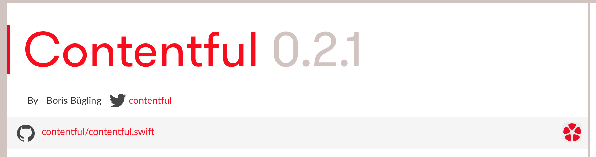

---

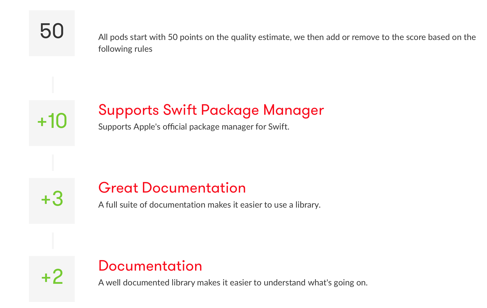

---

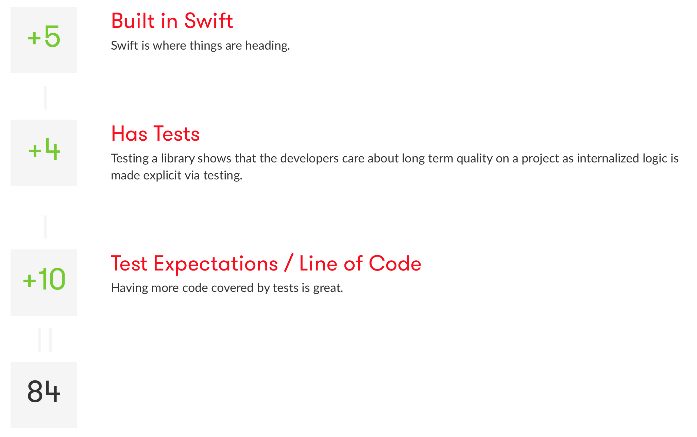

---

# Agenda

- Development
- Testing
- Documentation
- Deployment

---

# Development

---

## How do we talk about our APIs?

---

# API Blueprint

```markdown
## Choice [/questions/{question_id}/choices/{choice_id}]

+ Parameters
    + question_id: 1 (required, number) - ID of the Question in form of an integer
    + choice_id: 1 (required, number) - ID of the Choice in form of an integer

### Vote on a Choice [POST]

This action allows you to vote on a question's choice.

+ Response 201

    + Headers

            Location: /questions/1
```

^ A powerful high-level API design language for web APIs.

---

# Documentation

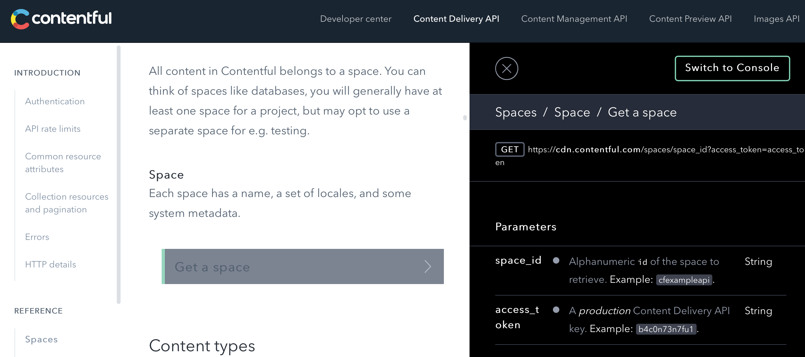

---

# Testing with `dredd`

```bash
node_modules/.bin/dredd out/cpa.apib https://preview.contentful.com
info: Beginning Dredd testing...
pass: GET /spaces/cfexampleapi?access_token=XXX duration: 846ms
pass: GET /spaces/cfexampleapi/content_types?access_token=XXX duration: 625ms
```

---

# API client coverage

```
* swift (25/31, missing: 6)
{
  "missing": {
    "GET": [
      "/spaces/{space_id}/entries?content_type={content_type}&{attribute}%5Bexists%5D={value}",
      "/spaces/{space_id}/entries?skip={value}",
      "/spaces/{space_id}/entries?include={value}",
      "/spaces/{space_id}/entries/{entry_id}?locale={locale}",
      "/spaces/{space_id}/sync?initial=true&type={type}",
      "/spaces/{space_id}/sync?initial=true&type=Entry&content_type={content_type_id}"
    ]
  }
}
```

---

# Written by my colleague Mario


---

## Mapping JSON responses to objects

- The hardest problem in Swift development 😉
- Lots of libraries tackling the problem
- My favourite: <https://github.com/Anviking/Decodable>

---

## Decoding JSON

```swift
struct Repository {
  let name: String
  let stargazersCount: Int
}

extension Repository: Decodable {
  static func decode(j: AnyObject) throws -> Repository {
    return try Repository(
      name: j => "nested" => "name",
      stargazersCount: j => "stargazers_count"
    )
  }
}
```

---

## Decoding JSON

```swift
do {
  let json = try NSJSONSerialization.JSONObjectWithData(data, options: [])
  let repo = try [Repository].decode(json)
} catch {
  print(error)
}
```

---

# Demo

`$ pod playgrounds Decodable`

---

# Dynamic APIs and type safety

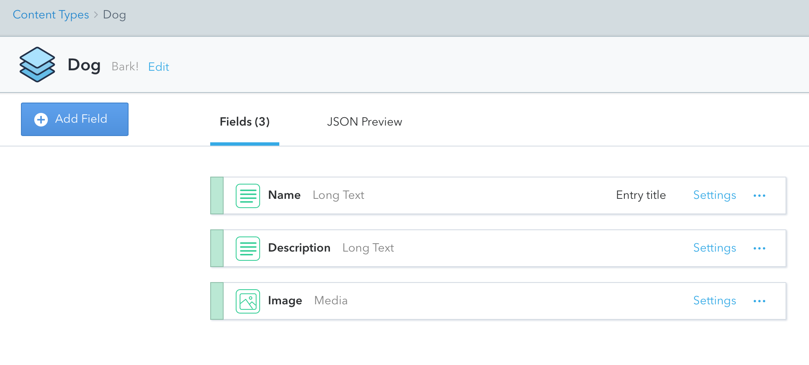

---

# Maps essentially to a `Dictionary`

```swift
/// An Entry represents a typed collection of data in Contentful
public struct Entry : Resource, LocalizedResource {
    /// System fields
    public let sys: [String:AnyObject]
    /// Content fields
    public var fields: [String:Any] {
        return Contentful.fields(localizedFields, forLocale: locale, 
          defaultLocale: defaultLocale)
    }

    [...]
}
```

---

### ...which makes a pretty annoying user experience

```swift
let name = entry.fields["name"] as! String
```

<br>

**Solution: code generation**

---

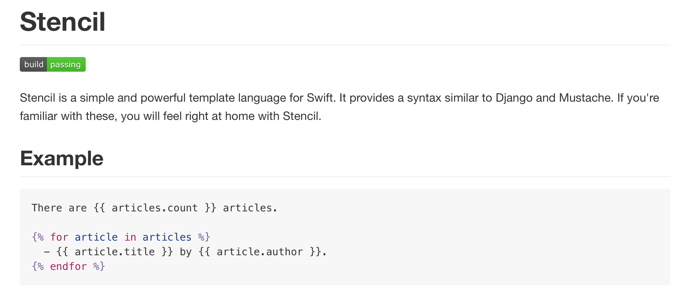

<https://github.com/kylef/stencil>

---

## Template


```swift
// This is a generated file.

import CoreLocation

struct {{ className }} {
  let {{ field.name }}: {{ field.type }}?
}

import Contentful

extension {{ className }} {
  static func fromEntry(entry: Entry) throws -> {{ className }} {
    return {{ className }}(
        {{ field.name }}: entry.fields["{{ field.name }}"] as? {{ field.type }},)
  }
}
```

---

```bash
$ contentful-generator cfexampleapi b4c0n73n7fu1 --output out
```

```swift
// This is a generated file.

import CoreLocation

struct Dog {
  let name: String?
  let description: String?
  let image: Asset?
}

import Contentful

extension Dog {
  static func fromEntry(entry: Entry) throws -> Dog {
    return Dog(
        name: entry.fields["name"] as? String,
        description: entry.fields["description"] as? String,
        image: entry.fields["image"] as? Asset)
  }
}
```

---

# Offer a first-party offline persistence solution

```swift
let store = CoreDataStore(context: self.managedObjectContext)
let sync = ContentfulSynchronizer(client: client, persistenceStore: store)

sync.mapAssets(to: Asset.self)
sync.mapSpaces(to: SyncInfo.self)

sync.map(contentTypeId: "1kUEViTN4EmGiEaaeC6ouY", to: Author.self)
sync.map(contentTypeId: "5KMiN6YPvi42icqAUQMCQe", to: Category.self)
sync.map(contentTypeId: "2wKn6yEnZewu2SCCkus4as", to: Post.self)
```

---

### Anticipating change is one of the central themes of REST.


---

# Example: creating a poll

---

```html
<html>
    <body>
        <h1>Poll</h1>
        <ul>
            <li><a href="/questions/new" rel="create">Make a new question</a></li>
        </ul>     
    </body>
</html>
```

---

- Offers us to create a question
- We can fill in the form we get
- Submit the form

---

# We can do the same in our apps with Hypermedia

---

# Formats

- HAL (application/hal+json)
- Siren (application/vnd.siren+json)

---

# Siren Link

```json
{
    "entities": [
        {
            "links": [
                { "rel": ["self"], 
                  "href": "questions/1/choices/1" }
            ],
            "rel": ["choices"],

            "properties": { "choice": "Swift", "votes": 22 }
        }
    ]
}
```

---

# Siren Action

```json
{
    "actions": {
        "create": {
            "href": "/questions",
            "method": "POST",
            "fields": [
                { "name": "question" },
                { "name": "choices" }
            ],
            "type": "application/x-www-form-urlencoded"
        }
    }
}
```

---

## We can now change implementation details on the fly

---

# Change URIs of resources

e.g. `/polls/{id}` to `/questions/{id}`

---

# Change HTTP methods

e.g. `PUT` to `POST`

---

# Change the content-type

---

# Change fields used in forms

---

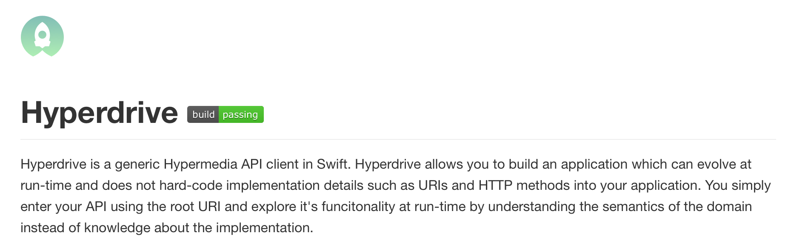 

---

# Demo

`$ pod playgrounds Hyperdrive`

---

# Testing

---

## Stub or mock HTTP requests

- Mockingjay
- CCLRequestReplay
- OHHTTPStubs
- VCRURLConnection
- ...

^ to make your tests fast and reliable

---

## But don't forget about the real API

- Record fixtures from live servers
- Leave the option to run against production
- ...and do that periodically

---

## Use stubbing to test error conditions

```swift
let error = NSError()
stub(http(.PUT, "/kylef/Mockingjay"), failure(error))
```

---

## Or faulty responses

```swift
let body = [ "description": nil ]
stub(http(.PUT, "/kylef/Mockingjay"), json(body))
```

---

# Use Xcode Code Coverage

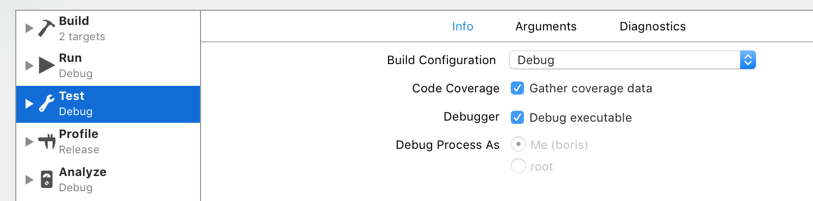

---

# Slather

```bash
$ bundle exec slather coverage -s Contentful.xcodeproj
Slathering...
Sources/Asset.swift: 17 of 27 lines (62.96%)
Sources/Client.swift: 126 of 164 lines (76.83%)
Sources/Configuration.swift: 14 of 15 lines (93.33%)
Sources/DecodableData.swift: 6 of 6 lines (100.00%)
Sources/Decoding.swift: 220 of 240 lines (91.67%)
Sources/Entry.swift: 19 of 19 lines (100.00%)
Sources/Resource.swift: 12 of 13 lines (92.31%)
Sources/SignalUtils.swift: 39 of 48 lines (81.25%)
Sources/SyncSpace.swift: 49 of 82 lines (59.76%)
Test Coverage: 81.76%
Slathered
```

---

## CI

```yaml 
language: objective-c
osx_image: xcode7.1
script:
- xcodebuild -workspace Contentful.xcworkspace \
  -scheme Contentful test -sdk iphonesimulator
- bundle exec slather coverage --coveralls Contentful.xcodeproj
- pod lib lint Contentful.podspec
```

---

# Documentation

---

### Swift supports inline documentation

```swift
extension Client {
    /**
     Perform an initial synchronization of the Space this client is constrained to.

     - parameter matching:   Additional options for the synchronization
     - parameter completion: A handler being called on completion of the request

     - returns: The data task being used, enables cancellation of requests
     */
    public func initialSync(matching: [String:AnyObject] = [String:AnyObject](), 
      completion: Result<SyncSpace> -> Void) -> NSURLSessionDataTask? {
        var parameters = matching
        parameters["initial"] = true
        return sync(parameters, completion: completion)
    }
}
```

---

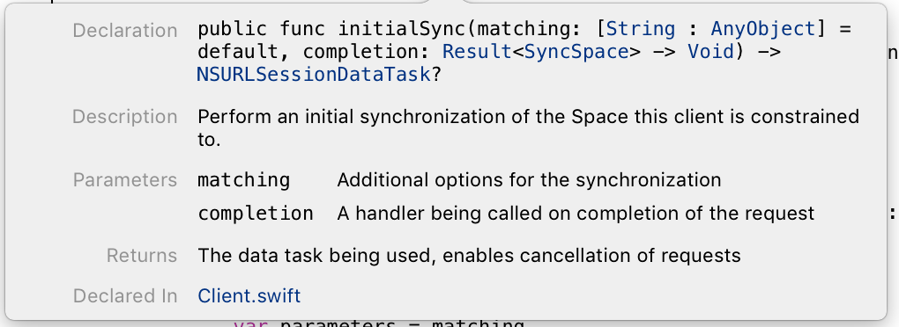

---

`$ bundle exec jazzy --podspec Contentful.podspec`

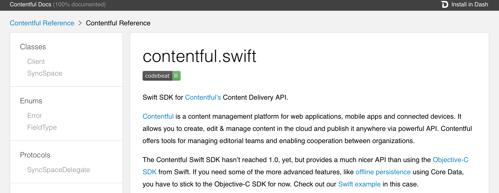

---

# VVDocumenter-Xcode

```swift
/**
     <#Description#>

     - parameter matching:   <#matching description#>
     - parameter completion: <#completion description#>

     - returns: <#return value description#>
*/
```

<https://github.com/onevcat/VVDocumenter-Xcode>

---

## Playgrounds

---

## Inline Markdown

```swift
/*: 
## Make the first request

Create a client object using those credentials, this will be used to make most API requests. */
let client = Client(spaceIdentifier: SPACE, accessToken: TOKEN)

/*: To request an entry with the specified ID: */
client.fetchEntry("5PeGS2SoZGSa4GuiQsigQu").1
    .error { print($0) }
    .next  {

/*: All resources in Contentful have a variety of read-only,
system-managed properties, stored in their “sys” property. This includes things like when 
the resource was last updated and how many revisions have been published. */
        print($0.sys)
```

---

## Rendered markup

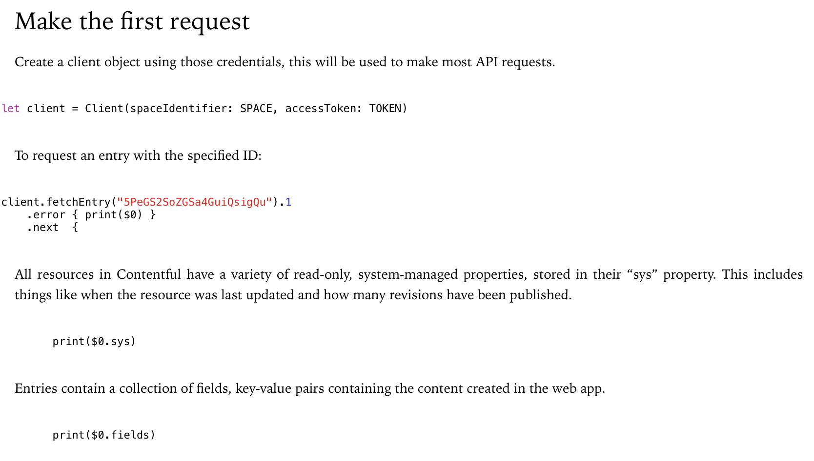

---

# Deployment

---

> "Download the SDK from our webpage."

---


---

```ruby
use_frameworks!

target 'My App' do

pod 'Contentful'

end
```

---

# Binary frameworks

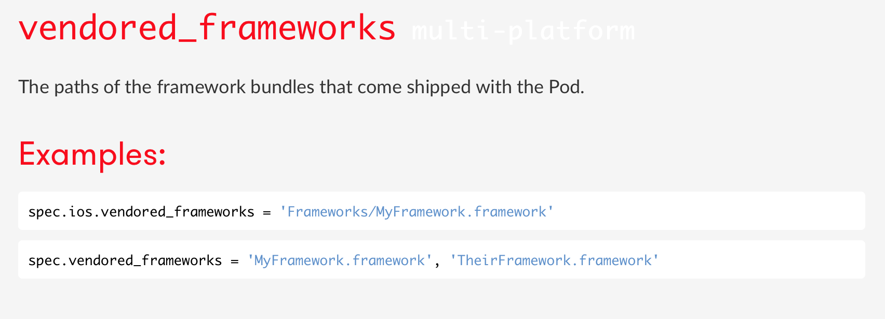

Please ship dynamic frameworks!

---

# Consider open source

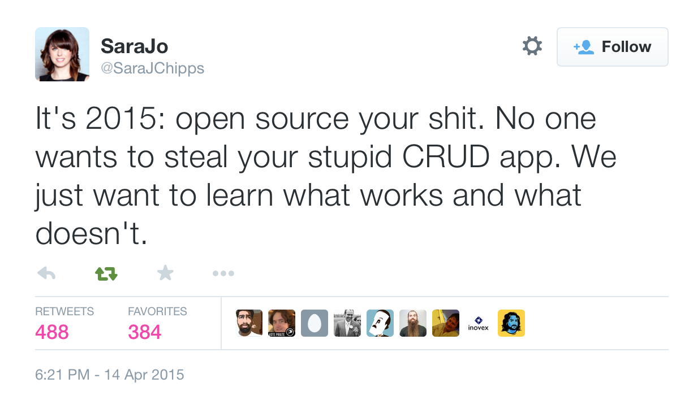

---

## Pod template

```bash
$ pod lib create Contentful
Cloning `https://github.com/CocoaPods/pod-template.git` into `Contentful`.
Configuring Contentful template.

[...]

What language do you want to use?? [ Swift / ObjC ]
 > 
swift

[...]

Running pod install on your new library.
```

---

# Also supports Carthage

```bash
$ carthage build --no-skip-current --platform iOS
$ carthage archive Contentful
```

<br>

**=> Share the result archive as part of your GitHub release**

---

## Keep in mind that Swift has no stable ABI

> While your app’s runtime compatibility is ensured, the Swift language itself will continue to evolve, and the binary interface will also change. To be safe, all components of your app should be built with the same version of Xcode and the Swift compiler to ensure that they work together.

---

# Don't forget Objective-C 😢

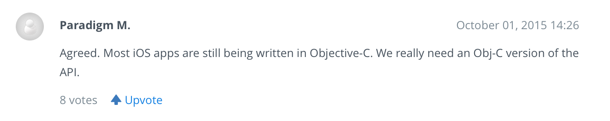

^ Dropbox released their v2 SDK as Swift-only, causing a fair bit of backlash from developers.

---

# What have we learned?

- Use Playgrounds and community-built tooling
- Document extensively
- Test thoroughly
- Open source your work

**=> Achieve that full quality index**

---


---

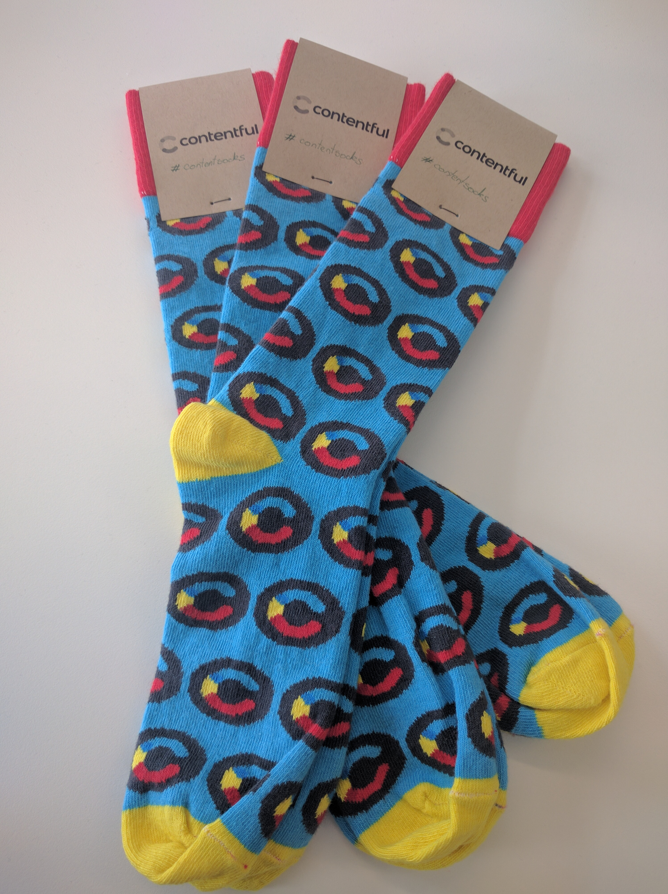

- 🖋 <https://www.contentful.com>
- 🐦 `#ContentSocks` at us
- 👞

<br>
<br>
<br>
<br>
<br>

@NeoNacho

boris@contentful.com

<http://buegling.com/talks>

^ Sign up for a Contentful account, tweet #ContentSocks, get socks (for the first 30 who sign up)
